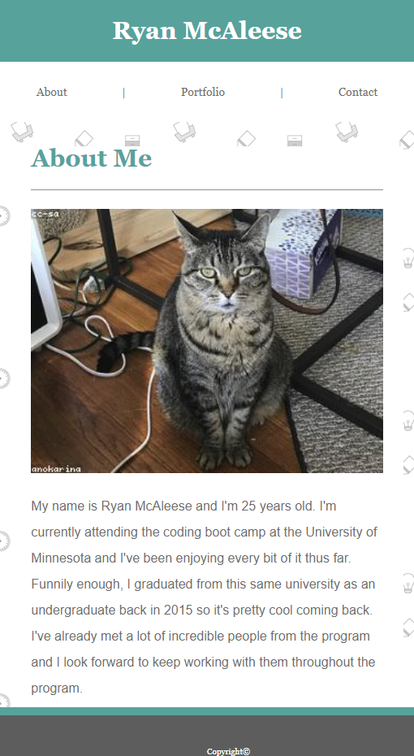
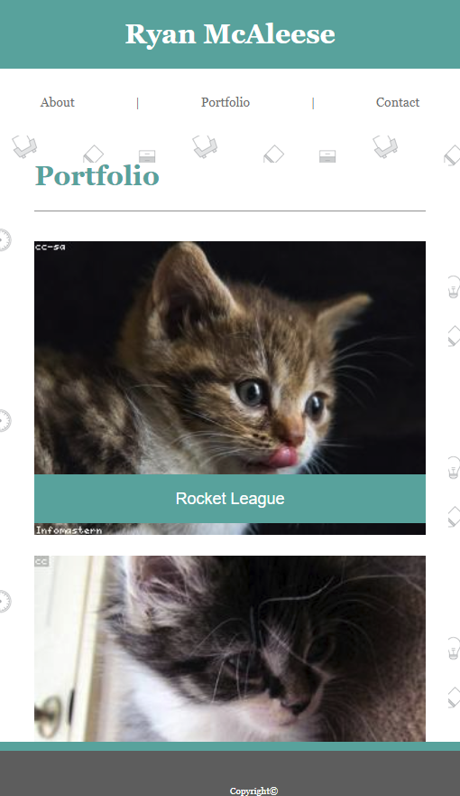
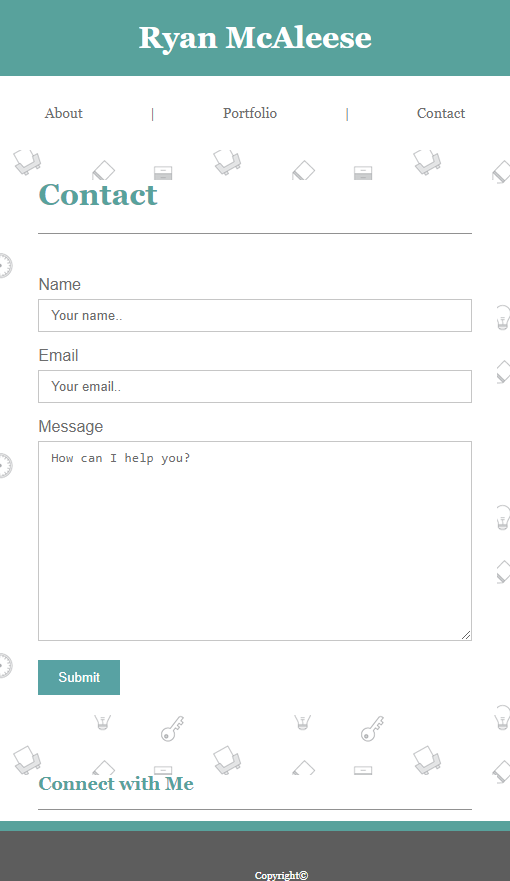
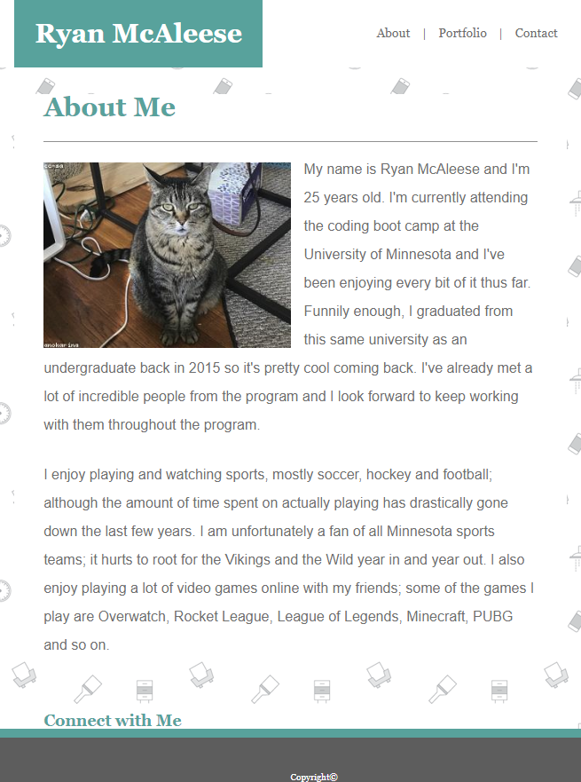
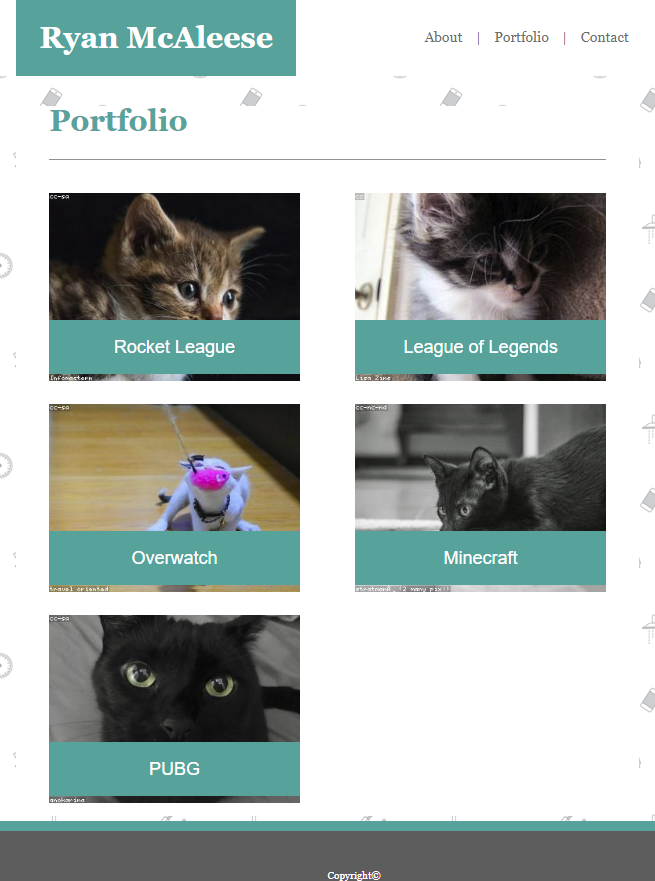
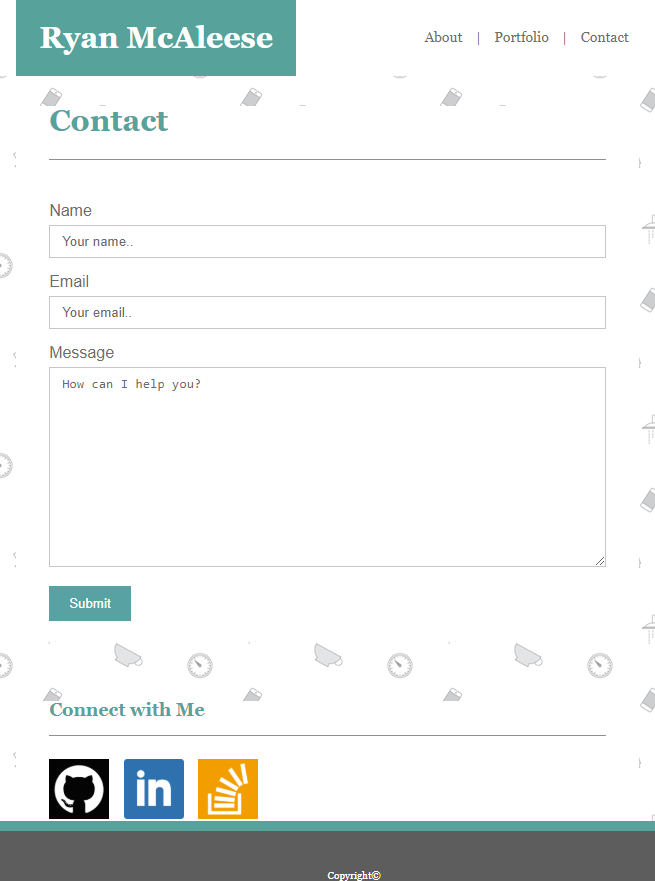
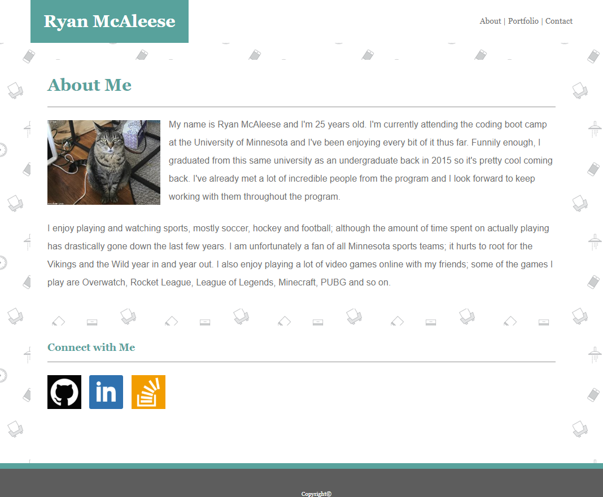
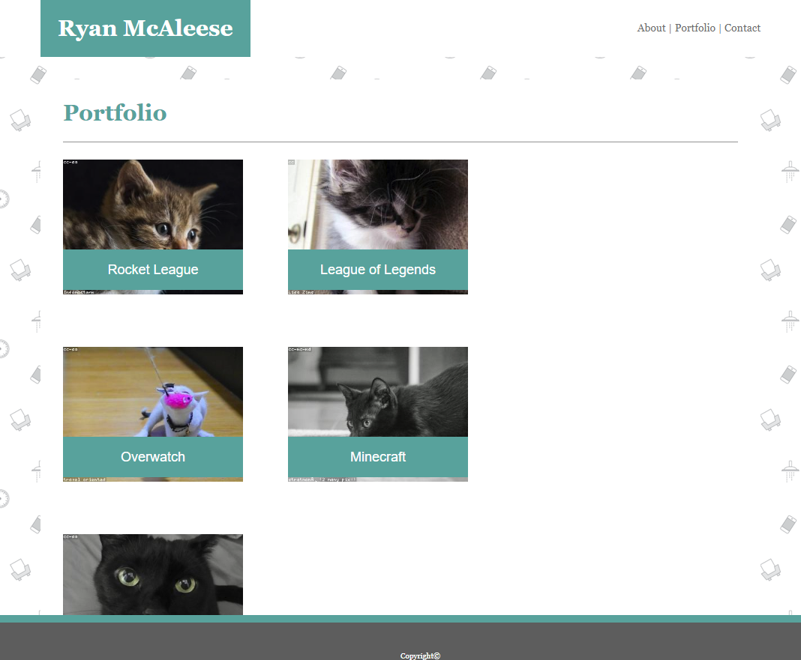
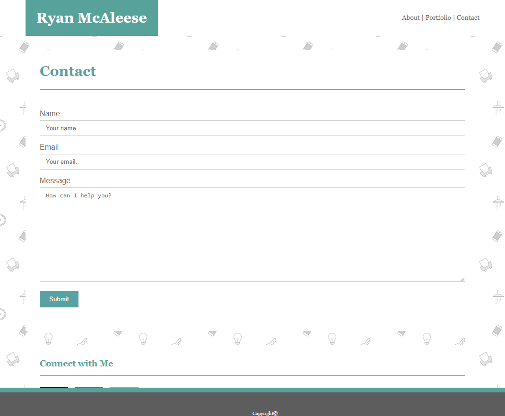

# Assignment 2 Responsive Portfolio

This project builds on Assignment 1 Basic Portfolio with media queries. The portfolio pages will respond accordingly to **3** different sizes of screen; **640px** (phone), **768px** (tablet), and **980px** (desktop). Click **[here][1]** for live version of the portfolio.

- 640px

    - index.html

    

    - portfolio.html

    

    - contact.html

    

- 768px

    - index.html

    

    - portfolio.html

    

    - contact.html

    

- 980px

    - index.html

    

    - portfolio.html

    

    - contact.html

    

[1]: https://mcale017.github.io/Assignment-2-Responsive-Portfolio/